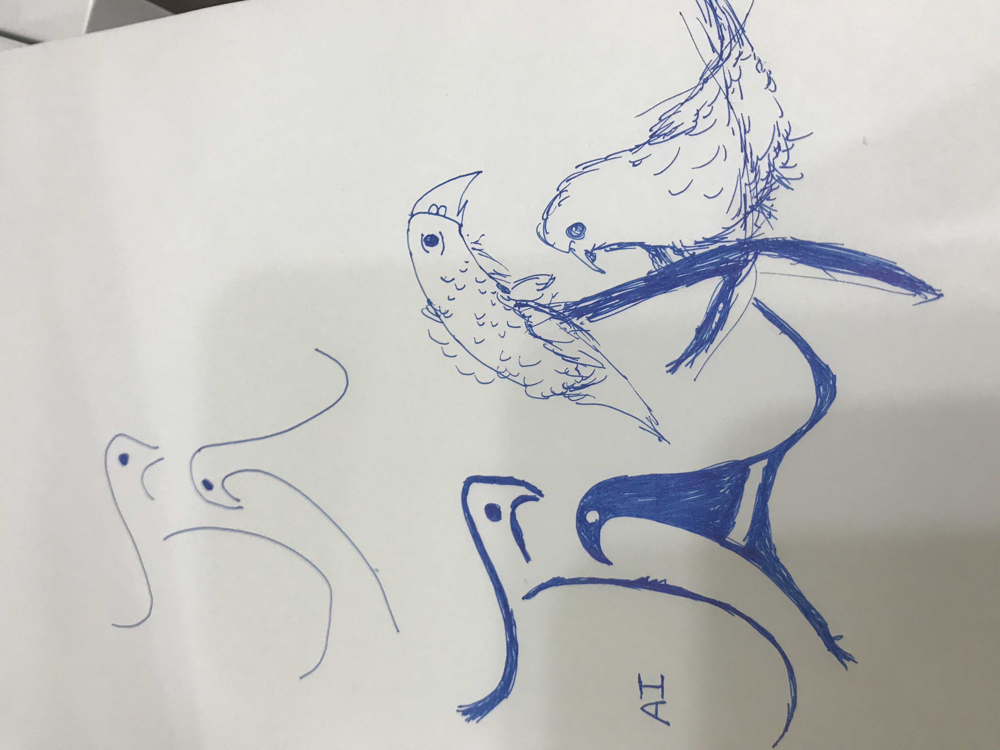
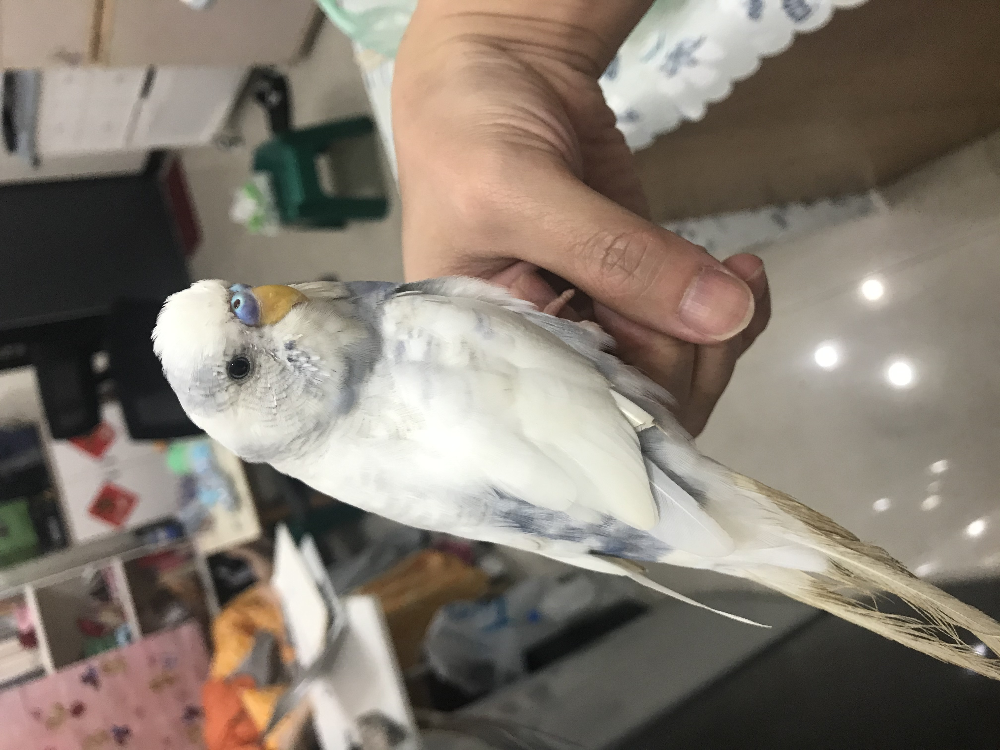
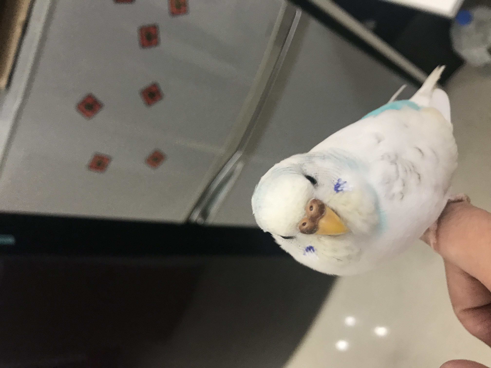

## Use Inksacpe for creating Logo

---

- [logo_01](#logo_01) ✅

- [logo_02](#logo_02) in progress 🦉...

---

---

## First LOGO done ... 🤔

## 

- 

---

## Need to create another one for in more detail

---

- Check the materials_2
- Draft
  
- A tsai (name)
  
- A Bo (name)
  

---

---
